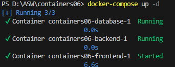
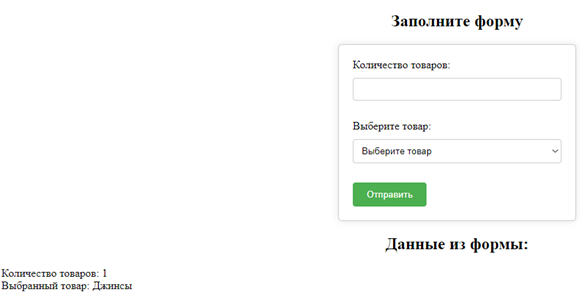

# Лабораторная работа: Создание многоконтейнерного приложения

## Цель работы
Ознакомиться с работой многоконтейнерного приложения на базе docker-compose.

## Задание
Создать php приложение на базе трех контейнеров: nginx, php-fpm, mariadb, используя docker-compose.

## Описание выполнения работы 
1. Создаем репозиторий containers06 и копиируем его себе на компьютер.
2. В директории containers06 создаем директорию mounts/site и переписываем в нее сайт на php.
3. Создаем файл .gitignore в корне проекта и добавляем в него строки для игнорирования файлов в директории mounts/site.
4. Создаем файл nginx/default.conf и добавляем в него конфигурацию nginx для нашего приложения.
5. Создаем файл docker-compose.yml с конфигурацией сервисов nginx, php-fpm и mariadb.
6. Создаем файл mysql.env с переменными окружения для mariadb.
7. Запускаем контейнеры командой docker-compose up -d.

8. Проверяем работу сайта, открыв в браузере http://localhost.

## Выводы
В ходе выполнения лабораторной работы было создано многоконтейнерное приложение на базе трех контейнеров: nginx, php-fpm и mariadb, используя Docker Compose.

## Ответы на вопросы
1. В каком порядке запускаются контейнеры? Сначала запускается контейнер database, затем backend и frontend.
2. Где хранятся данные базы данных? Данные базы данных хранятся в том, названном db_data.
3. Как называются контейнеры проекта? Контейнеры проекта называются database, backend, и frontend.
4. Вам необходимо добавить еще один файл app.env с переменной окружения APP_VERSION для сервисов backend и frontend. Как это сделать? Для добавления переменной окружения APP_VERSION для сервисов backend и frontend, необходимо отредактировать файл docker-compose.yml и добавить раздел environment в каждый из этих сервисов, указав нужные переменные:
